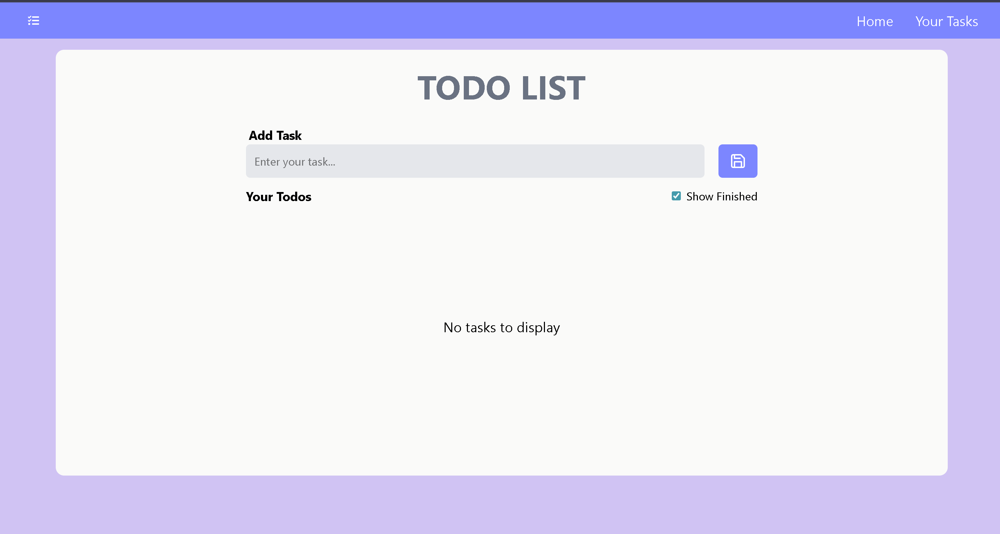

# 📝 React ToDo List App

Deployment: (react-to-do-app-peach.vercel.app)

A simple and elegant **ToDo List App** built with React.  
It allows users to add, edit, delete, and mark tasks as completed.  
All tasks are stored in **localStorage**, so they persist even after refreshing the page.

---

## 🚀 Features

- ➕ Add new tasks  
- ✏️ Edit existing tasks  
- 🗑️ Delete tasks  
- ✅ Mark tasks as complete/incomplete  
- 👀 Toggle "Show Finished" tasks  
- 💾 Data persistence using `localStorage`  
- 🎨 Clean UI with Tailwind CSS  

---

## 🖼️ Preview


---

## 🛠️ Tech Stack

- [React](https://reactjs.org/)  
- [Vite](https://vitejs.dev/) (for fast development)  
- [Tailwind CSS](https://tailwindcss.com/) (for styling)  

---

## 📦 Installation & Setup

1. Clone the repository:
   ```bash
   git clone https://github.com/your-username/todo-list.git
   cd todo-list
